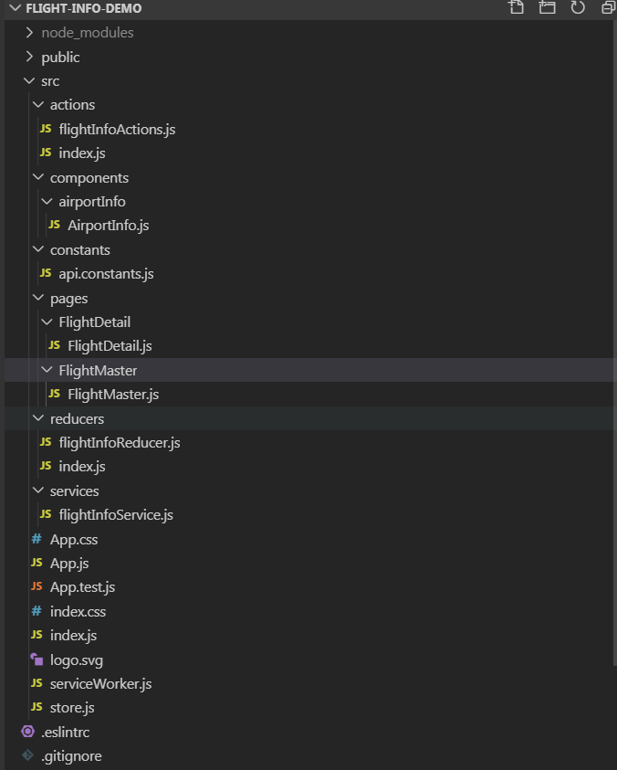
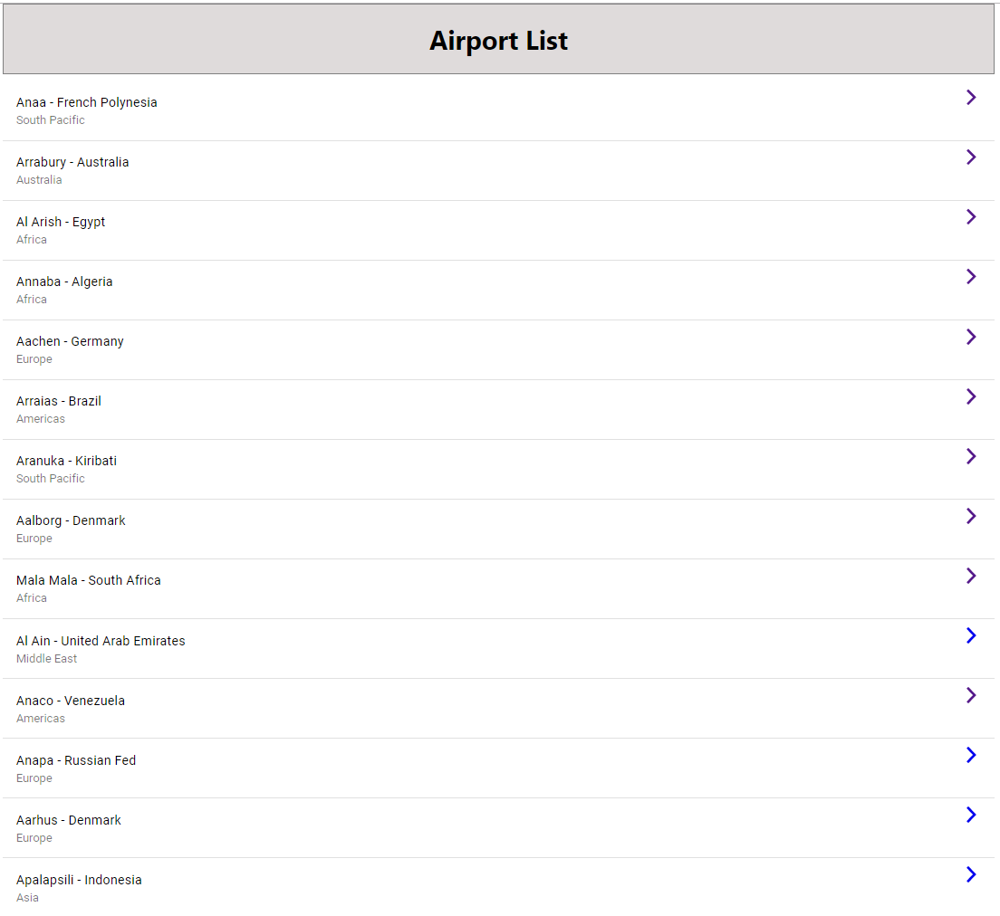
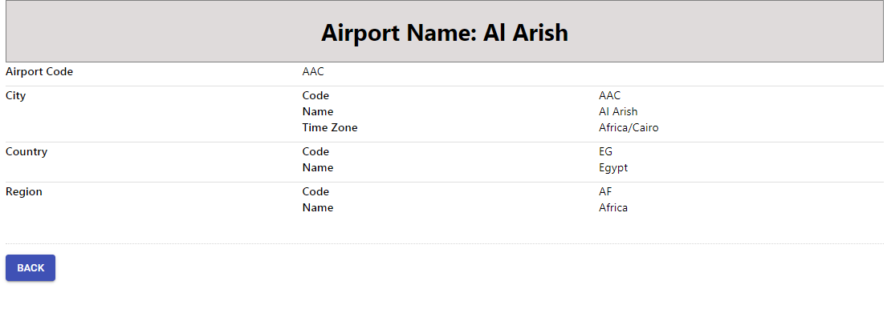

This project was bootstrapped with [Create React App](https://github.com/facebook/create-react-app).

# Welcome to my airport infomration demo - build with React + Redux + Redux-Thunk + Axios

## 1. Quick Start

In the project directory, you can run:

### `npm start`

Runs the app in the development mode. 
Open [http://localhost:3000](http://localhost:3000) to view it in the browser.

### unit test

Because of time limit, unit test is pending.

### project strucure

## 2. Main Feature

This is a sample airport information page, it will show a list of airport, when click on a particular item, it navigates to the airport details page.

Click on one of the item, it will navigate to the detail page.

Click on Back button, it will return to the master page.
